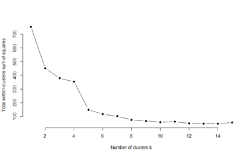

### Introduction ###
This report aims to apply R-Studio to import the NYC Real Estate data from the Boston
University SQL server, and do conduct the descriptive analytics in terms of different
statistics, and then perform K-mean
clustering of all neighborhoods based on three selected Key Performance Indicators.
Finally, a comparison of the average residential property costs between BedfordStuyvesant and Crown Heights was performed to test the alternative hypothesis that the
average sale pries are different in both neighborhoods.

### Author ###
Ivan Chen